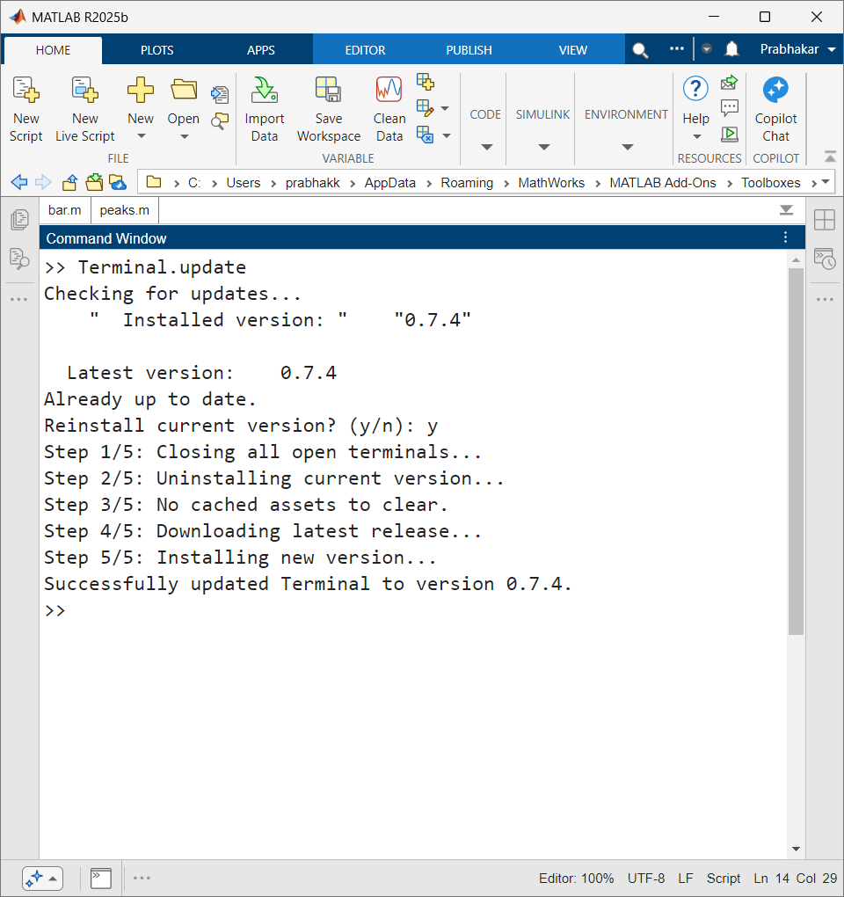
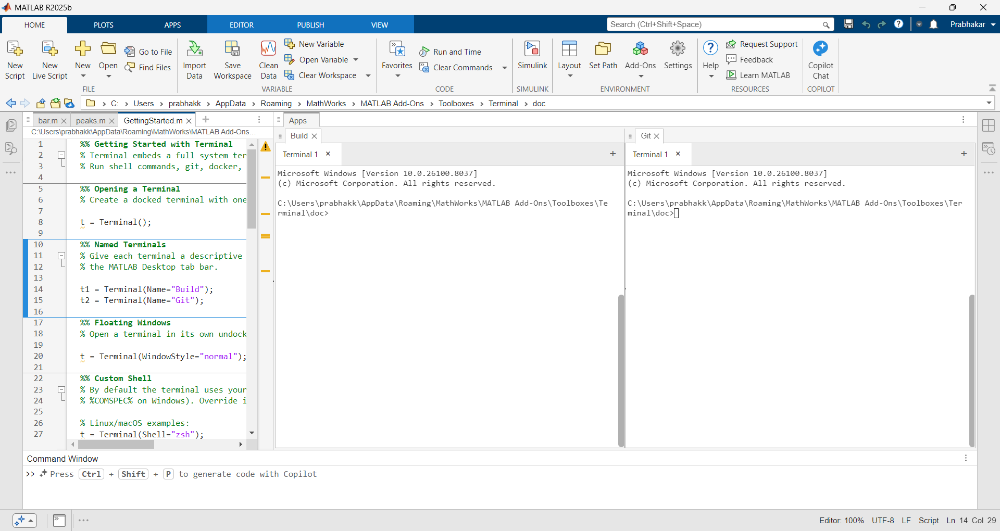
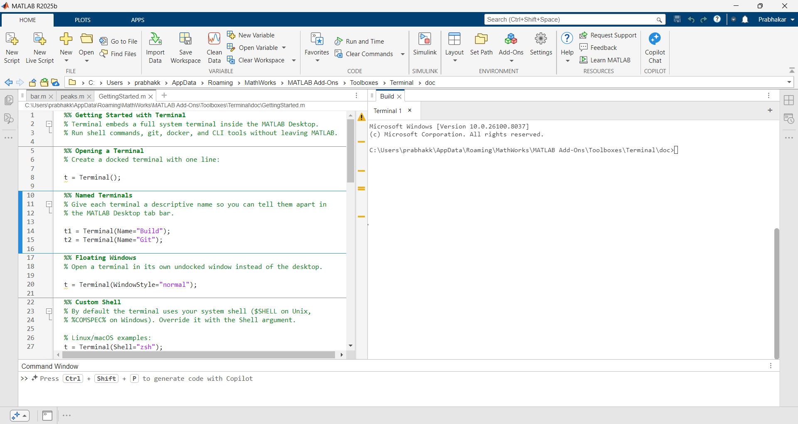
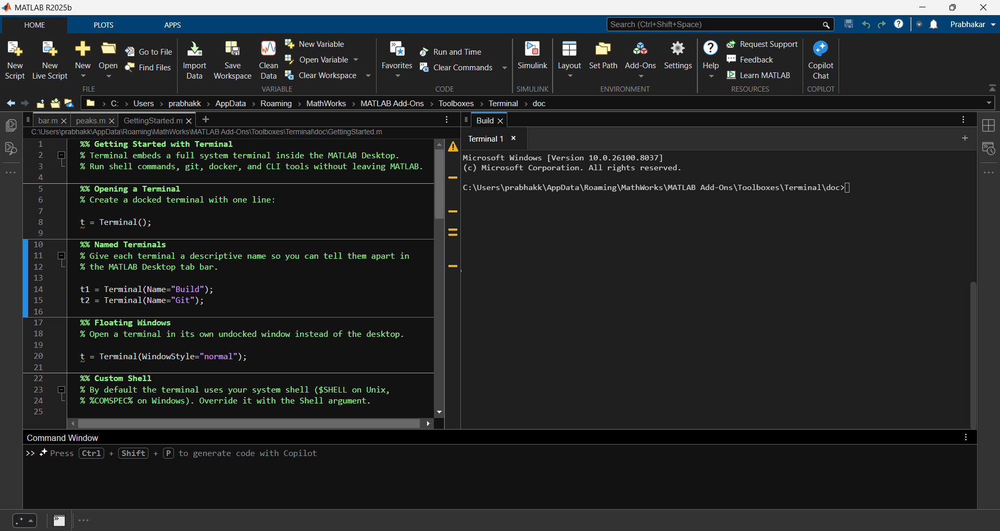

# Terminal in MATLAB®

Embed a full system terminal in the MATLAB® Desktop. Run shell commands, `git`, `docker`, AI coding agents, and other CLI tools without leaving MATLAB.


## Installation

Download `Terminal.mltbx` from the [latest release](../../releases/latest) and install:

```matlab
matlab.addons.install('Terminal.mltbx')
```

On first launch, bundled assets are automatically extracted to a local cache. No additional setup is required.

### Requirements

- MATLAB R2020b or later
- Linux®, macOS®, or Windows®

## Getting Started

```matlab
% Open a docked terminal
t = Terminal();

% Open with a custom title
t = Terminal(Name="Build");

% Open in a floating window
t = Terminal(WindowStyle="normal");

% Open with a specific shell
t = Terminal(Shell="zsh");            % Linux/macOS
t = Terminal(Shell="powershell.exe"); % Windows

% List all running terminals
Terminal.list()

% Close all running terminals
Terminal.closeAll()

% Close a single terminal
delete(t);

% Query the shell in use
t.Shell

% Check the installed version
Terminal.version()

% Check for updates and install the latest version from GitHub
Terminal.update()
```

| Shortcut | Action |
|----------|--------|
| Ctrl+Shift+C | Copy selection |
| Ctrl+Shift+V | Paste |
| `exit` | Close current terminal tab |

## Updating

```matlab
Terminal.update()
```

This queries GitHub for the latest release, displays a version comparison, and prompts for confirmation before upgrading. The update process closes all open terminals, uninstalls the current version, clears cached assets, downloads the new `.mltbx`, and installs it.



## Uninstalling

```matlab
matlab.addons.uninstall('Terminal')
```

## Features

- **Full terminal emulator** — PTY-based with 256-color support, cursor movement, and escape sequences. Interactive tools like `vim`, `htop`, and `ssh` work correctly.
- **Cross-platform** — Linux, macOS, and Windows. Uses `creack/pty` on Unix and ConPTY on Windows.
- **Configurable shell** — Specify a shell with `Terminal(Shell="zsh")`. Defaults to `$SHELL` on Unix, `%COMSPEC%` on Windows.
- **Tabbed interface** — Open multiple terminal sessions in a single panel. Create, close, and switch tabs.

  

- **Docked in MATLAB Desktop** — The terminal panel docks into the MATLAB layout like any other tool window. Undock to a floating window with `WindowStyle="normal"`.
- **Theme integration** — Inherits the MATLAB theme (light or dark), code font family, and font size. Switching themes updates all open terminals in real time.

  | Light | Dark |
  |-------|------|
  |  |  |
- **Copy and paste** — Ctrl+Shift+C to copy, Ctrl+Shift+V to paste.
- **Instance management** — `Terminal.list()` returns handles to all running terminals. `Terminal.closeAll()` closes them all.
- **Self-updating** — `Terminal.update()` checks GitHub for new releases and walks through the upgrade interactively.
- **Auto-cleanup** — Closing the last tab closes the window. The server process is terminated when the terminal is deleted or MATLAB exits. An idle timeout acts as a safety net.
- **Environment variables** — Terminal sessions have `MATLAB_PID` and `MATLAB_ROOT` set, allowing CLI tools to discover the running MATLAB instance.
- **Event API (R2023a+)** — On R2023a and later, uses `sendEventToHTMLSource`/`HTMLEventReceivedFcn` for reliable keystroke delivery with no data loss. Older releases fall back to the Data channel with buffering.
- **matlab-proxy compatible** — Works in browser-based MATLAB via [matlab-proxy](https://github.com/mathworks/matlab-proxy).
- **Zero runtime dependencies** — No Node.js®, Python®, or Java® required. A single Go binary handles all PTY management.

### Release-Dependent Behavior

| Behavior | Details |
|----------|---------|
| Docked window style | Supported on releases where `uifigure` accepts `WindowStyle='docked'`. On releases that do not support it (e.g., R2024a), the terminal falls back to a normal floating window with a warning. |
| Reliable keystroke delivery | R2023a and later use the event-based API with no data loss. Older releases use the Data channel with buffering; fast typing may lose characters. |
| Live theme switching | Detects MATLAB theme changes by polling `DefaultFigureColor`. On releases where this property does not update, restart the terminal to pick up theme changes. |

## Known Limitations

- **Session persistence** — Terminal sessions are not preserved across MATLAB restarts.
- **Docked mode not available on all releases** — `uifigure` `WindowStyle='docked'` is not supported on some releases (e.g., R2024a). The terminal automatically falls back to a normal floating window.
- **Character swallowing on pre-R2023a** — The legacy Data channel is property-based (last-write-wins). Fast typing can lose characters, especially in matlab-proxy. On R2023a and later, the event-based API eliminates this issue.
- **Line wrapping in matlab-proxy** — Long lines may overwrite from the start instead of wrapping correctly.
- **Terminal unresponsive during computation** — The terminal relies on the MATLAB main thread for polling the server and updating the UI. When MATLAB is busy executing code, the terminal freezes until MATLAB returns to idle. This is a fundamental constraint of `uihtml`, which cannot load URLs — JS cannot communicate directly with the server via WebSocket, so all I/O must be routed through MATLAB.
- **uihtml caching** — MATLAB caches HTML and CSS files aggressively. Changes to the frontend require a MATLAB restart to take effect.

---

## Developer Guide

### Repository Structure

```
matlab-terminal/
├── toolbox/                        # Toolbox source (becomes .mltbx content)
│   ├── Terminal.m                  # Main MATLAB class
│   ├── TerminalVersion.m          # Version string (stamped at build time)
│   ├── openTerminal.m              # Launcher for Apps tab
│   ├── doc/                        # Documentation
│   │   └── GettingStarted.m       # Getting Started guide (shown on install)
│   ├── images/                     # Toolbox icon
│   │   └── matlab-terminal.jpeg
│   └── html/                       # Web frontend
│       ├── index.html              # Terminal UI (all JS inline, uihtml requirement)
│       ├── terminal.css            # Tab bar, theme, loading overlay styles
│       └── lib/xterm/              # Vendored xterm.js + fit addon
├── server/                         # Go server source
│   ├── main.go                     # Entry point, CLI flags, HTTP routes
│   ├── api.go                      # HTTP API handlers (create, input, resize, poll)
│   ├── session.go                  # PTY session lifecycle
│   ├── pty.go                      # Platform-agnostic PTY interface
│   ├── pty_unix.go                 # Unix PTY implementation (creack/pty)
│   ├── pty_windows.go              # Windows PTY implementation (ConPTY)
│   ├── shell_unix.go               # Default shell detection (Unix)
│   ├── shell_windows.go            # Default shell detection (Windows)
│   ├── auth.go                     # Token validation middleware
│   └── go.mod / go.sum             # Go dependencies
├── build/                          # Build tooling (not shipped in .mltbx)
│   ├── build_assets.m              # Bundles web assets + binary into .mat
│   ├── package.m                   # Builds .mltbx (function, accepts version arg)
│   └── setup_xterm.sh              # Downloads and vendors xterm.js
├── dist/                           # Build output (gitignored)
│   ├── glnxa64/                    # Linux binary
│   ├── maci64/                     # macOS Intel binary
│   ├── maca64/                     # macOS Apple Silicon binary
│   ├── win64/                      # Windows binary
│   └── Terminal.mltbx              # Installable toolbox package
├── DESIGN.md                       # Architecture decisions and security analysis
├── SECURITY.md                     # Vulnerability reporting and security details
└── README.md
```

### Architecture

```
MATLAB (Terminal.m)  ←— Event API (R2023a+) / Data channel —→  uihtml (xterm.js)
        │
        │  HTTP polling (100ms)
        ▼
Go server (matlab-terminal-server)  ←→  PTY sessions (creack/pty on Unix, ConPTY on Windows)
```

- **Frontend**: xterm.js hosted in `uihtml`. All JS is inline (uihtml sandboxes external scripts).
- **Backend**: Go binary managing PTY sessions over a localhost HTTP API with token authentication.
- **Bridge**: MATLAB polls the server and relays output to JS. JS input is queued and sent through MATLAB.
- **Communication**: On R2023a and later, uses the event-based API (`sendEventToHTMLSource`/`HTMLEventReceivedFcn`) for reliable message delivery. On older releases, falls back to the Data channel with buffering to mitigate last-write-wins behavior.

See [DESIGN.md](DESIGN.md) for detailed architecture decisions and security analysis.

### Development Setup

1. **Build the Go server** (requires Go 1.21+):
   ```bash
   cd server/
   ```
   Build into `dist/<arch>/` where `<arch>` matches the platform:

   | Platform | `<arch>` | Build command |
   |----------|----------|---------------|
   | Linux x86_64 | `glnxa64` | `mkdir -p ../dist/glnxa64 && go build -o ../dist/glnxa64/matlab-terminal-server .` |
   | macOS Intel | `maci64` | `mkdir -p ../dist/maci64 && GOARCH=amd64 go build -o ../dist/maci64/matlab-terminal-server .` |
   | macOS Apple Silicon | `maca64` | `mkdir -p ../dist/maca64 && GOARCH=arm64 go build -o ../dist/maca64/matlab-terminal-server .` |
   | Windows x86_64 | `win64` | `mkdir -p ../dist/win64 && GOOS=windows GOARCH=amd64 go build -o ../dist/win64/matlab-terminal-server.exe .` |

2. **Add the toolbox to the MATLAB path**:
   ```matlab
   addpath('/path/to/matlab-terminal/toolbox')
   ```

3. **Launch**:
   ```matlab
   Terminal()
   ```

When running from source, `Terminal.m` uses `html/` directly and finds the server binary in `dist/<arch>/`. No `.mat` extraction is needed.

### Building a Release

The release artifact is a single file: `Terminal.mltbx`. It bundles the MATLAB code, web frontend, and platform-specific Go binaries into a self-contained installable package.

#### Local build

Requires MATLAB and compiled Go binaries in `dist/<arch>/`.

```matlab
cd /path/to/matlab-terminal
addpath('build')

% Dev build (uses version from TerminalVersion.m, defaults to 0.0.0-dev)
package()

% Release build with explicit version
package("1.2.0")
```

Output: `dist/Terminal.mltbx`

#### What `package()` does

1. **Resolves version** — Uses the provided argument, or falls back to the value in `TerminalVersion.m`. Stamps `TerminalVersion.m` with the build version so it is baked into the `.mltbx`.
2. **Bundles assets** — `build_assets.m` reads `html/` files and all server binaries from `dist/<arch>/`, packing them as byte arrays into `toolbox/web_assets.mat`. This works around `packageToolbox` silently dropping `.html`, `.css`, `.js`, and binary files.
3. **Packages toolbox** — `packageToolbox` creates the `.mltbx` from `toolbox/`, which includes the `.mat` alongside `.m` files, the Getting Started guide, and the toolbox icon.

At runtime, `Terminal.m` extracts assets from `web_assets.mat` to `prefdir/matlab-terminal/` on first launch (version-stamped to avoid re-extraction).

### CI/CD Pipeline (GitHub Actions)

A release build involves three stages: cross-compiling Go binaries for all platforms, bundling them into a `.mltbx`, and creating a GitHub Release.

The workflow is defined in `.github/workflows/release.yml` and triggered by pushing a version tag:

```bash
git tag v0.7.0
git push origin v0.7.0
```

**Pipeline stages:**

1. **`build-server`** — Cross-compiles the Go binary for Linux (`glnxa64`), macOS Intel (`maci64`), macOS Apple Silicon (`maca64`), and Windows (`win64`) in parallel using a build matrix.
2. **`build-mltbx`** — Downloads all binaries into `dist/<arch>/`, sets up MATLAB via `matlab-actions/setup-matlab`, and runs `package()` with the git tag as the version argument to create a single `.mltbx` containing all platform binaries.
3. **`release`** — Creates a GitHub Release with the `.mltbx` attached and commit-based release notes.

> **Note**: The `matlab-actions/setup-matlab` action requires a [MATLAB batch licensing token](https://www.mathworks.com/help/cloudcenter/ug/matlab-batch-licensing-tokens.html). MathWorks® provides free CI licenses for public repositories.

The resulting `.mltbx` is a single cross-platform artifact. At install time, `Terminal.m` extracts the correct binary for the user's platform based on `computer('arch')`.

## License

See [LICENSE.md](LICENSE.md) for details.

## Community Support

This repository is maintained by The MathWorks, Inc. Filed issues are reviewed by maintainers but responses are not guaranteed.

- **Bug reports and feature requests** — [GitHub Issues](../../issues)
- **Security vulnerabilities** — Report to [security@mathworks.com](mailto:security@mathworks.com). See [SECURITY.md](SECURITY.md) for details.

---

Copyright 2026 The MathWorks, Inc.
